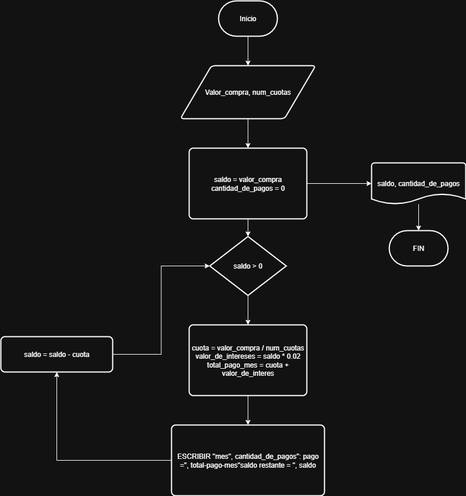

# Ejercicio 1

Se requiere un algoritmo para determinar, de N cantidades; cuantas son cero, cuantas son menores a cero, y cuantas son mayores a cero.
Realice el diagrama de flujo y el pseudocodigp representario, utilizando el ciclo apropiado.

|Variables | tipo | cometario|
|---------|-------|----------|
| N       | Entrada|
|cant     | Entrada|
|ceros    | salida |contador |
|mayeros  | salida |Contador |
|menores  | salida |Contador |

## Pseudocodigo

 ```
 Inicio
 Leer N
 ceros = 0
 mayores = 0
 menores = 0
 Mientras N > 0:
     Leer cant:
      Si cant > 0:
        mayores = menores +1
    
     si no 
        si cant = 0
            ceros = ceros + 1
        Si no 
          menores = menores + 1
        Fin Si
    Fin Si
    N = N - 1
Fin mientras 
Mostrar ceros, mayores, menores
Fin
```
## Diagrama


 
 # Ejercicio 2

 Calcular el factorial de un numero entero ingresado por el usuario

 ## Pseudocodigo

 ```
 Inicio
 Leer N
 Mientras N
```

# Tarea

Consultar cómo funcionan las tarjetas de crédito. Asumir una tasa de interés fija (2%). Preguntar al usuario el valor de la compra y el número de cuotas. Calcular y mostrar en pantalla. El valor de cada una de las cuotas que debe pagar hasta saldar la deuda. 

## pseudocodigo

```
INICIO
    LEER valor_compra
    LEER num_cuotas
    tasa_interes = 0.02
    saldo = valor_compra
    cantidad_de_pagos = 0

    MIENTRAS saldo > 0 HACER
        cuota = valor_compra / num_cuotas
        valor_de_interes = saldo * tasa_interes
        total_pago_mes = cuota + valor_de_interes

        saldo = saldo - cuota
        cantidad_de_pagos = cantidad_de_pagos + 1
        cantidad_de_cuotas_restantes = num_cuotas - cantidad_de_pagos

        ESCRIBIR "Mes ", cantidad_de_pagos, ": pago = ", total_pago_mes, 
                  " saldo restante = ", saldo
    FIN MIENTRAS

    SI saldo = 0 ENTONCES
        ESCRIBIR "Deuda saldada"
    FIN SI
FIN
```
## diagrama


