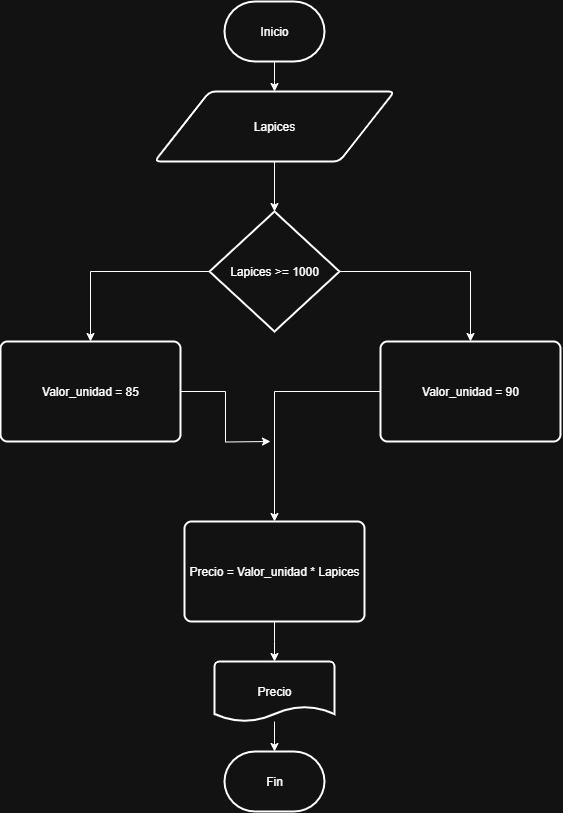

# pseudocodigo
Inicio
Leer base, altura
Calcular área = (base * altura) / 2
Mostrar área
Fin

# Ejercicio 1

| **Símbolo**         | **Nombre**           | **Forma**       | **Función o Uso**                                                                   |
| ------------------- | -------------------- | --------------- | ----------------------------------------------------------------------------------- |
| 🔵 Inicio / Fin     | Terminal             | Óvalo o Elipse  | Indica el **inicio** o el **final** de un algoritmo.                                |
| 🟩 Proceso          | Proceso              | Rectángulo      | Representa una **acción**, como cálculos o asignación de valores.                   |
| 🟨 Entrada / Salida | Entrada / Salida     | Paralelogramo   | Se utiliza para **leer datos** o **mostrar resultados** al usuario.                 |
| 🔶 Decisión         | Condición / Decisión | Rombo           | Representa una **pregunta lógica**, donde el flujo depende de la respuesta (Sí/No). |
| ⚪ Conector          | Conector             | Círculo pequeño | Se usa para **unir partes** del diagrama cuando hay salto de una parte a otra.      |
| ➡️ Línea de Flujo   | Flujo de proceso     | Flecha          | Indica la **dirección** o el **orden** en que se ejecutan las operaciones.          |


# Ejercicio 2
Construye un algoritmo que, al recibir como datos el ID del empleado y los seis primeros sueldos del año, calcule el ingreso total semestral y el promedio mensual, e imprima el ID del empleado, el ingreso total y el promedio mensual.

## Solución 
```
Inicio
Leer ID, S1, S2, S3, S4, S5, S6
Total = S1 + S2 + S3 + S4 + S5 + S6
Promedio = Total / 6
Escribir ID, total, Promedio
Fin
```

### Diagrama de flujo


# Ejercicio 3
Realice un algoritmo para determinar cuánto se debe pagar por equis cantidad de lápices considerando que si son 1000 o más el costo es de $85 cada uno; de lo contrario, el precio es de $90. Represéntelo con el pseudocódigo y el diagrama de flujo.

|Variables| Tipo| Comentario|
|---------|-----|----------|
|Lapices  | Entrada| Cantidad de lapices|
|precio  | Salida| Precio total de los lapices|
|Valor_unidad| Intermedia | Valor unitario de cada lapiz|
|85, 90 | Constantes| No cambian|

## Pseudocodigo
```
Inicio
Leer Lapices
Si Lapices >= 1000:
    Valor_unidad = 85
Si no
    Valor_unidad = 90
Fin Si
Precio = Lapices * Valor_unidad
Escribir "El valor total es:", Precio
Fin
```
## Diagrama


# Ejercicio 4

Un almacén de ropa tiene una promoción: por compras superiores a $250 000 se les aplicará un descuento de 15%, de caso contrario, sólo se aplicará un 8% de descuento. Realice un algoritmo para determinar el precio final que debe pagar una persona por comprar en dicho almacén y de cuánto es el descuento que obtendrá. Represéntelo mediante el pseudocódigo y el diagrama de flujo.

## Analisis
|Variables| Tipo| Comentario|
|---------|-----|----------|
| Total_compra | Entrada | Valor de la compra |
| Descuento    | Salida  | Descuento segun el valor de la compra |
| precio-final | Salida | Valora a pagar |
| 15%, 8%, $250000 | Constantes | Descuentos y valor limite |

## Pseudocodigo
```
Inicio
Leer total_compra
Si total_compra > 250000:
    descuento = total_compra * 0.15%
Si no
    descuento = total_compra * 0.08
Fin si
Precio_final = total_compra - descuento
Escribir "valor a pagar", precio_final
Fin
```
# Ejercicio 5

El director de una escuela está organizando un viaje de estudios, y requiere determinar cuánto debe cobrar a cada alumno y cuánto debe pagar a la compañía de viajes por el servicio. La forma de cobrar es la siguiente: si son 100 alumnos o más, el costo por cada alumno es de $65.00; de 50 a 99 alumnos, el costo es de $70.00, de 30 a 49, de $95.00, y si son menos de 30, el costo de la renta del autobús es de $4000.00, sin importar el número de alumnos.

## Analisis
|Variables| Tipo| Comentario|
|---------|-----|-----------|
|alumnos | Entrada| Cantidad de alumnos|
|costo_alumno | Salida| Costo segun la cantidad de alumnos|
|costo_total  | Salida| Costo total a pagar|
|100_65$, 50-99_70$, 30-49_95$, 1-30_4000$(sin importar la cantidad de alumnos)| Constantes| cantidad de alumnos y costo por alumno según la cantidad|


# Tarea

## Pseudocodigo

```
Entrada de datos
Leer fecha_dia, fecha_mes, fecha_año
Leer nacimiento_dia, nacimiento_mes, nacimiento_año

 Cálculo inicial de la edad
edad = fecha_año - nacimiento_año

 Ajuste si el cumpleaños aún no ha llegado este año
Si (fecha_mes < nacimiento_mes) O (fecha_mes = nacimiento_mes Y fecha_dia < nacimiento_dia) Entonces
    edad = edad - 1
FinSi

 Salida
Mostrar "La edad es: ", edad

FIN
```
## Diagrama


